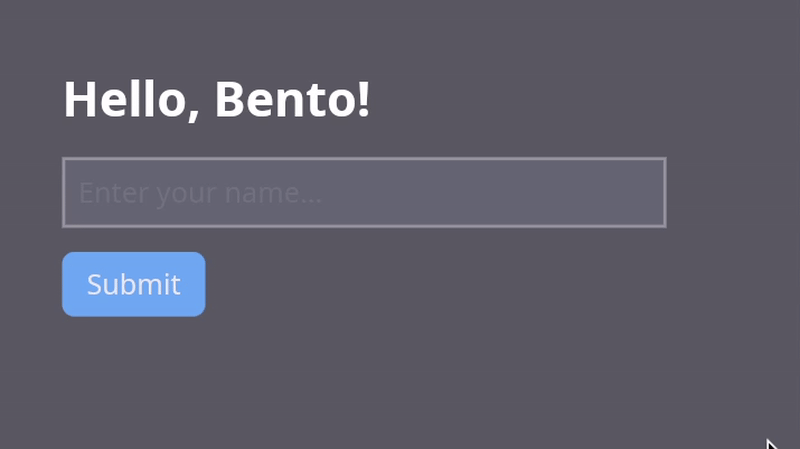
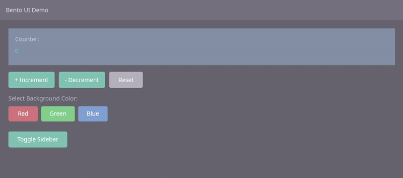

<h1 align="center">Bento</h1> 
<p align="center"><strong>Rust GUI framework</strong></p>

## Features

* Architecture inspired by [Elm](https://github.com/elm) and [Iced](https://github.com/iced-rs/iced)
* Intuitive declarative API
* Cross-platform, runs on Windows, macOS, and Linux
* GPU-accelerated rendering via a custom wgpu based rendering layer
* Flexbox layout engine with support for grow, shrink, padding, margin, alignment, absolute positioning, overflow, etc
* Composable styling (colors, borders, border radius, opacity, shadows, and more)
* Async task system (futures, background threads, delays, repeating intervals, exclusive tasks, and timeouts)
* Builtin widget library
* Font loading and management
* Keyboard, mouse, and window event handling

Bento is built on top of:
* **[`winit`](https://github.com/rust-windowing/winit)** for window handling
* **[`wgpu`](https://github.com/gfx-rs/wgpu)** for 2D rendering
* **[`Glyphon`](https://github.com/grovesNL/glyphon)** for text rendering
* **[`Taffy`](https://github.com/DioxusLabs/taffy)** for layout
* **[`Tokio`](https://github.com/tokio-rs/tokio)** for async task runtime


## Examples
Simple text input:
```rust
        column(vec![
            text("Hello, Bento!", Color::hex("#ffffff"))
                .font_size(24.0)
                .font_weight(700),
            text_input("name")
                .value(&self.name)
                .placeholder("Enter your name...")
                .on_change(|v| Action::UpdateName(v))
                .width(px(300.0)),
            button("Submit")
                .on_click(Action::Submit)
                .background(Color::hex("#2563eb"))
                .border_radius(6.0),
        ])
        .padding(Edges::all(32.0))
        .gap(12.0)
```





